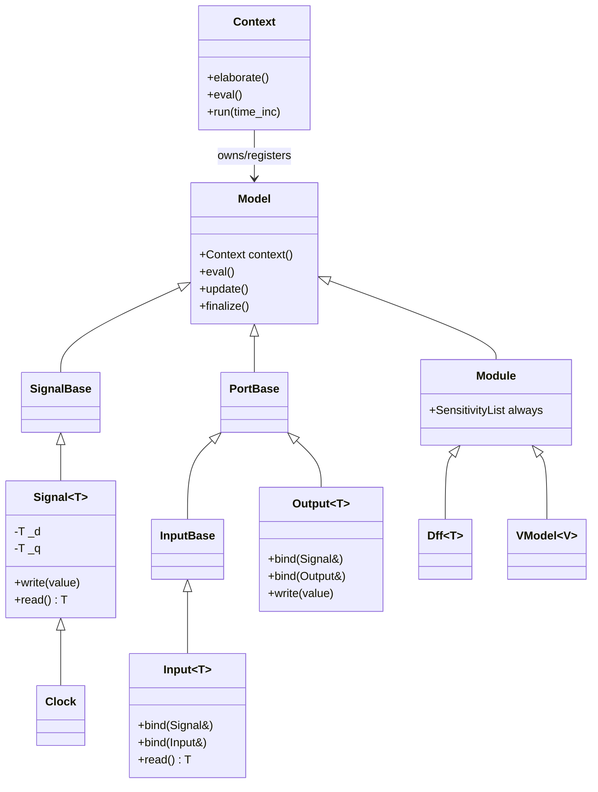

# dspsim Architecture Overview

`dspsim` is a C++ discrete-event (delta-cycle) simulation engine, exposed to Python via
nanobind, used to simulate hardware designs — either hand-written C++ models or
Verilator-generated models of SystemVerilog RTL. This document describes how the core
pieces fit together. For the simulation scheduling algorithm itself, see
[DeltaCycle.md](DeltaCycle.md).

## Component map



## Core classes (`src/dspsim/framework/include/dspsim/`)

### `Model` ([model.h](../src/dspsim/framework/include/dspsim/model.h))
Base class for everything that participates in simulation (signals, ports, modules).
On construction it self-registers with the currently active `Context`. Exposes the
three lifecycle hooks every subclass can override:
- `finalize()` — called once by `Context::elaborate()`, after the whole design is built.
- `eval()` — compute next-state values (may call `Signal::write`, which only sets a
  pending value).
- `update()` — commit pending values and notify anything watching them.

### `Context` ([context.h](../src/dspsim/framework/include/dspsim/context.h) / [context.cpp](../src/context.cpp))
Owns a simulation: the list of registered models, the delta-cycle scheduling stacks
(`_eval_stack`, `_update_stack`), and a time-ordered `_time_event_stack` for scheduled
future events (clock edges, etc.). A global `ContextFactory` tracks the "active"
context; `Context::create()`/`obtain()`/`reset()` manage it.

Key methods:
- `elaborate()` — calls `finalize()` on every registered model (this is what
  triggers lazy port-binding resolution, see below), then schedules every `Module`
  for one initial evaluation so combinational logic settles from its default signal
  values before the first explicit `eval()`. A module can opt out of this initial
  pass by calling `dont_initialize()` in its constructor.
- `eval()` — runs delta cycles until the eval stack is empty (see
  [DeltaCycle.md](DeltaCycle.md)).
- `run(time_inc)` — runs a delta cycle, then advances simulated time through the
  scheduled time-event stack, running a delta cycle at each time step.

### `Signal<T>` ([signal.h](../src/dspsim/framework/include/dspsim/signal.h) / [signal.cpp](../src/signal.cpp))
Holds a committed value `_q` and a pending value `_d`.
- `write(value)` sets `_d` and schedules the signal for evaluation.
- `read()` returns `_q` (the last committed value).
- `update()` commits `_d` → `_q` (only if it actually changed), computes an
  `EventType` (`Changed`/`Posedge`/`Negedge`), and notifies:
  - every subscribed `PortBase*` (`_subscribers`, populated by `Input`/`Output` binds), and
  - any `Module` sensitized directly to the signal via `always << signal;` /
    `always << signal.pos();` / `always << signal.neg();` (`_changed_subscribers` /
    `_posedge_subscribers` / `_negedge_subscribers`, pushed straight onto the eval stack).

  The second mechanism lets a module react to an internal `Signal` member it reads
  directly, without needing an intermediate `Port`.

### `Port` (`Input<T>` / `Output<T>`, [port.h](../src/dspsim/framework/include/dspsim/port.h) / [port.cpp](../src/port.cpp))
Connect a `Module`'s I/O to a `Signal`, or hierarchically to another port of the
same direction (e.g. a submodule's `Input` bound to its parent's `Input`).

- `bind(Signal<T>&)` binds directly to a signal (subscribes/drives immediately).
- `bind(Input<T>&)` / `bind(Output<T>&)` only *records* the relationship
  (`_bound_ports`); nothing is resolved yet, so ports can be bound in any order,
  even before the ultimate `Signal` exists.
- `finalize()` calls `resolve()`, which recursively walks `_bound_ports` down to
  wherever a real `Signal` was bound, caches it as `_bound_tsignal`, and (for
  `Input`) subscribes to it. This is what makes the binding "lazy": nothing needs
  to be wired in a particular construction order as long as everything is bound by
  the time `Context::elaborate()` runs.
- `notify(EventType)` (on `Input`) pushes any `Module` sensitized to this port
  (via `always << port;` / `.pos()` / `.neg()`) onto the context's eval stack.

### `Module` / `ModuleName` ([module.h](../src/dspsim/framework/include/dspsim/module.h), [module_name.h](../src/dspsim/framework/include/dspsim/module_name.h))
A `Model` with a `SensitivityList always`. Submodules and ports can be declared as
ordinary class members in any order — `ModuleName` uses an RAII trick: its
constructor pushes the module's name onto the context's active-module stack, and
when the temporary `ModuleName` argument is destroyed (i.e. right after the
`Module`'s member-initializer list runs, before the constructor body), it pops the
stack. This is why every `Module` subclass takes a `ModuleName name` constructor
parameter by value.

`dont_initialize()` lets a module opt out of `Context::elaborate()`'s automatic
initial evaluation pass (useful for modules whose `eval()` isn't safe/meaningful
to run before real stimulus is applied).

### `SensitivityList` ([sensitivity_list.h](../src/dspsim/framework/include/dspsim/sensitivity_list.h))
Implements the `always << x` syntax. `x` can be a `Port` or a `Signal` (or
`.pos()`/`.neg()` of either) — anything convertible to `SensitivityEvent`
(`std::vector<Module*>`). It just appends the enclosing module to that event's
subscriber list.

### `Clock` ([clock.h](../src/dspsim/framework/include/dspsim/clock.h) / [clock.cpp](../src/clock.cpp))
A `Signal<uint8_t>` that toggles itself and reschedules via the context's
time-event stack every half period.

### `Dff<T>` ([dff.h](../src/dspsim/framework/include/dspsim/dff.h) / [dff.cpp](../src/dff.cpp))
Minimal flip-flop module: `q.write(d.read())` on the rising edge of `clk`. Used as
a basic building block and in tests.

### `VModel<V, TraceType>` ([vmodel.h](../src/dspsim/framework/include/dspsim/vmodel.h))
Wraps a Verilator-generated model class `V` as a `dspsim::Module`, forwarding
`eval()`/`update()` to `top->eval_step()`/`top->eval_end_step()` and optionally
dumping a trace (VCD/FST) each update. This is the bridge between hand-written
`dspsim` code and Verilated SystemVerilog.

## Delta-cycle execution model

See [DeltaCycle.md](DeltaCycle.md) for the full description; in short,
`Context::eval()` is two-phase per round:
1. Pop everything currently in `_eval_stack` and call `eval()` on each — this may
   call `Signal::write()`, which only sets the pending value and reschedules the
   signal (deferred, not committed yet).
2. Pop everything that was just evaluated (now in `_update_stack`) and call
   `update()` — this is where `Signal` values actually commit and subscribers get
   notified, which may schedule *more* models for the next round.

This repeats until `_eval_stack` is empty. Because commits only happen in the
update phase, all modules evaluated in the same round see a consistent snapshot of
signal values — but a module is only re-scheduled in a later round if it (or one
of its ports) is actually sensitized to whatever changed. This is why combinational
logic needs `always <<` sensitivity for every signal it reads, whether through a
`Port` or a raw `Signal` member.

## `Context::run()` and time-event scheduling

`eval()` alone only advances *delta cycles* — it never moves simulated time
forward. `run(time_inc)` is what drives the clock:

```cpp
void Context::run(uint64_t time_inc)
{
    eval();
    while (!_time_event_stack.empty() and time_inc > 0)
    {
        uint64_t next_time_step = _time_event_stack.top().time_update - _time;
        _time += next_time_step;
        time_inc -= next_time_step;
        do
        {
            auto event = _time_event_stack.pop();
            _eval_stack.push(event.subscriber);
        } while (!_time_event_stack.empty() && _time_event_stack.top().time_update == _time);
        eval();
    }
}
```

1. It first runs a normal delta cycle (`eval()`), settling anything already
   pending at the current time.
2. Then, while there are scheduled time events left and simulated time hasn't
   used up the requested `time_inc`, it jumps straight to the timestamp of the
   *nearest* scheduled event (`_time_event_stack.top()`), advancing `_time` by
   that gap rather than stepping one unit at a time.
3. It pops every event scheduled for that exact timestamp (there can be more
   than one, e.g. several clocks with the same period) and pushes each event's
   subscriber onto `_eval_stack`.
4. It runs another delta cycle (`eval()`) so those models — and anything they
   trigger transitively — settle before time advances again.
5. This repeats until `time_inc` is exhausted or there are no more scheduled
   events.

### The time-event stack
`_time_event_stack` is a `SortedStack<TimeEvent>` — a `std::priority_queue`
ordered with `std::greater`, so `top()`/`pop()` always return the
soonest-scheduled `TimeEvent` (a `{Model *subscriber, uint64_t time_update}`
pair), independent of push order. `_push_time_event_stack(event)` is the only
way to add to it, called via `context()->_push_time_event_stack(...)`.

### How a `Clock` uses it
`Clock` is a `Signal<uint8_t>` that schedules itself the moment it's
constructed (`context()->_push_eval_stack(this)`), and its `eval()` is where the
self-rescheduling loop lives:

```cpp
void Clock::eval()
{
    this->_d = !this->_q;
    context()->_push_time_event_stack(TimeEvent(this, context()->time() + _half_period));
}
```

Each time the clock evaluates, it flips its pending value and schedules a
`TimeEvent` for itself one half-period in the future. `Context::run()` picks that
event up when simulated time reaches it, pushes the `Clock` back onto
`_eval_stack`, and the whole cycle (flip, commit via `update()`, notify
posedge/negedge subscribers, schedule the next flip) repeats indefinitely —
this is what makes a `Clock` free-running once it's part of an elaborated
design, without any code needing to re-arm it manually.

## Python bindings and code generation

- `_framework.cpp` uses [nanobind](https://github.com/wjakob/nanobind) to expose
  `Context`, `Model`, `Signal8/16/32/64`, `Clock`, `Dff8/16/32/64` to Python as the
  `dspsim._framework` extension module. (Note: as of this writing this file
  references `eval_step()`/`eval_end_step()`, which predate the current
  `eval()`/`update()` API on `Model` — treat it as due for a refresh if you're
  working on the Python bindings.)
- `src/dspsim/framework/verilator.py` wraps the `verilator` executable
  (`verilate()`/`verilate_json()`) to compile SystemVerilog into a Verilated C++
  model and to introspect a module's ports/parameters via `verilator --json-only`.
- `cmake/dspsim-utils.cmake`'s `dspsim_add_module()` is the CMake entry point:
  it runs `python -m dspsim.framework.generate` against a `pyproject.toml` to
  Verilate `.sv` sources and generate a nanobind-wrapped `<name>.cpp` /
  `<name>_include.cmake`, builds it as a nanobind extension linked against
  `dspsim::dspsim-core`, and generates `.pyi` stubs.

## Relationship to `dspsim-library`

`dspsim` (this repo) is the simulation engine plus the build/codegen tooling.
`dspsim-library` is a *consumer*: a curated set of reusable HDL modules (`Skid.sv`,
`SimpleModel.sv`, ...) packaged as a Python library. Its `CMakeLists.txt` locates
an **installed** `dspsim` (`python -m dspsim.framework --cmake_dir`), calls
`find_package(dspsim)`, then `dspsim_add_module(_library ...)` to Verilate its
`.sv` sources into a compiled `_library` extension module usable from Python.

## Testing

- C++ tests live in `tests/cpp/` and are all compiled into one Catch2 executable,
  `tests` (see `tests/cpp/CMakeLists.txt`). **Each test file must wrap its
  file-local helper classes in an anonymous `namespace { ... }`** — since every
  test `.cpp` links into the same binary, two files declaring the same class name
  at global scope is an ODR violation that silently corrupts objects at runtime
  (the linker merges the symbols across translation units).
  Run with `./scripts/cpptest.sh [catch2 tag filter]`.
- Python tests (`tests/test_*.py`) exercise the Python-facing API (`Context`,
  signals, project/verilator integration).
