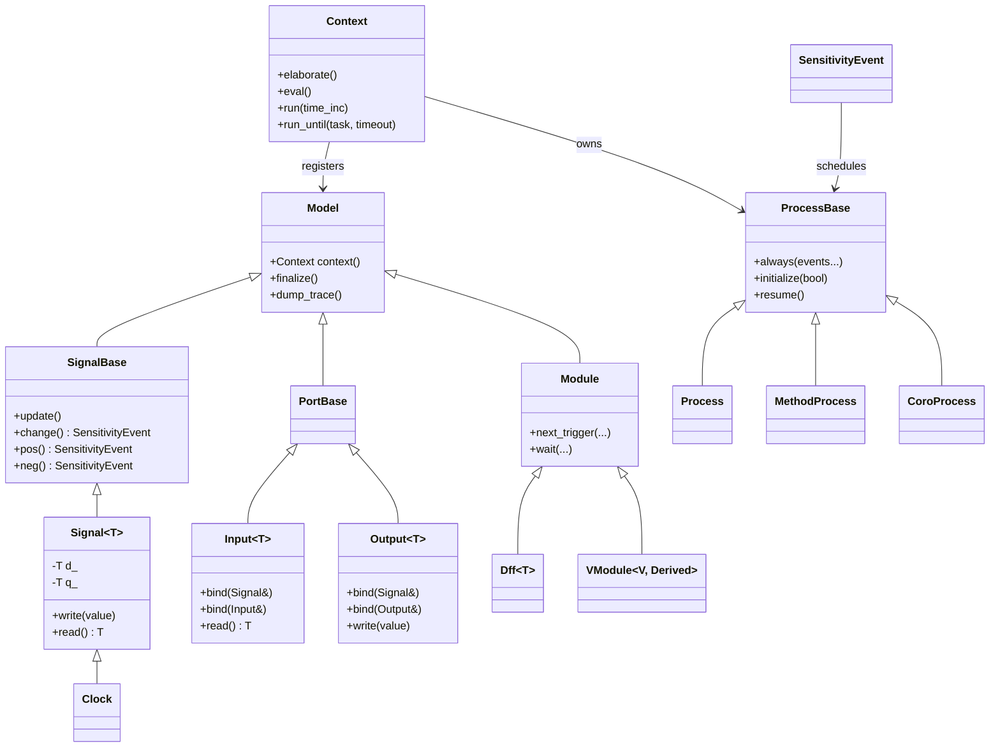

# dspsim Architecture Overview

`dspsim` is a C++ discrete-event (delta-cycle) simulation engine, exposed to Python via
nanobind, used to simulate hardware designs, either hand-written C++/Python models or
Verilator-generated models of Verilog/SystemVerilog RTL. This document describes how the core
pieces fit together. Related documents: [Coro.md](Coro.md) (coroutine processes and
awaitables) and [BitSlicing.md](BitSlicing.md) (bit slicing and packing).

## Component map


```mermaid
classDiagram
    Model <|-- SignalBase
    Model <|-- PortBase
    Model <|-- Module
    SignalBase <|-- Signal~T~
    Signal~T~ <|-- Clock
    PortBase <|-- Input~T~
    PortBase <|-- Output~T~
    Module <|-- Dff~T~
    Module <|-- VModule~V, Derived~
    ProcessBase <|-- Process
    ProcessBase <|-- MethodProcess
    ProcessBase <|-- CoroProcess

    class Model {
        +Context context()
        +finalize()
        +dump_trace()
    }
    class Context {
        +elaborate()
        +eval()
        +run(time_inc)
        +run_until(task, timeout)
    }
    class SignalBase {
        +update()
        +change() SensitivityEvent
        +pos() SensitivityEvent
        +neg() SensitivityEvent
    }
    class Signal~T~ {
        -T d_
        -T q_
        +write(value)
        +read() T
    }
    class Input~T~ {
        +bind(Signal&)
        +bind(Input&)
        +read() T
    }
    class Output~T~ {
        +bind(Signal&)
        +bind(Output&)
        +write(value)
    }
    class Module {
        +next_trigger(...)
        +wait(...)
    }
    class ProcessBase {
        +always(events...)
        +initialize(bool)
        +resume()
    }
    Context --> Model : registers
    Context --> ProcessBase : owns
    SensitivityEvent --> ProcessBase : schedules
```

## Core classes (`src/include/dspsim/`, sources in `src/`)

### `Model` ([model.h](../src/include/dspsim/model.h) / [model.cpp](../src/model.cpp))
Base class for everything that is part of a design (signals, ports, modules). On
construction it self-registers with the context under construction (`Context::obtain()`),
gets a unique id, and records the module being constructed as its parent, which gives it
a hierarchical name (`hier_name()`). It has two virtual hooks:
- `finalize()`: called once by `Context::elaborate()`, after the whole design is built.
- `dump_trace()`: called at the end of a delta cycle on models that requested tracing.

Models do not evaluate themselves. Evaluation belongs to processes, and committing values
belongs to signals (see below).

### `Context` ([context.h](../src/include/dspsim/context.h) / [context.cpp](../src/context.cpp))
Owns a simulation: the registered models, the processes, the delta-cycle scheduling
stacks (`_process_eval_stack`, `_signal_update_stack`, `_derived_update_stack`,
`_sensitivity_event_stack`), and a time-ordered `_time_event_stack` for scheduled future
events (clock edges, time waits).

A global `ContextFactory` tracks the context under construction. `Context::create()`
takes a construction lock: another thread calling `create()` blocks until the context is
elaborated or `release()`d, and the same thread calling it again gets
`ContextConstructionError` (`Context::reset()` discards the active context).
`Context::obtain()` never creates a context. It throws unless the calling thread has one
under construction, so models can only be built between `create()` and `elaborate()`.

Key methods:
- `elaborate()`: calls `finalize()` on every registered model (this is what triggers lazy
  port-binding resolution, see below), locks the design, and releases the context from
  the global factory so a new, independent context can be created.
- `eval()`: runs delta cycles until nothing is left to evaluate or update (see
  [Delta-cycle execution model](#delta-cycle-execution-model)).
- `run(time_inc)`: runs a delta cycle, then advances simulated time through the scheduled
  time events, running a delta cycle at each time step. The first `run()` also schedules
  the initial evaluation: every process is evaluated once so that combinational logic
  settles from the initial signal values. A process opts out with `initialize(false)`,
  which chains with `always(...)`.
- `run_until(task, timeout)` / `run_until(event, timeout)`: run the simulation until a
  coroutine task completes (returning its value) or an event triggers. See
  [Coro.md](Coro.md).

### `Signal<T>` ([signal.h](../src/include/dspsim/signal.h) / [signal.cpp](../src/signal.cpp))
Holds a committed value `q_` and a pending value `d_`. `SignalBase` owns three
`SensitivityEvent`s: `change()`, `pos()`, and `neg()`.
- `write(value)` sets `d_` and, if it differs from `q_`, pushes the signal onto the
  context's `_signal_update_stack`.
- `read()` returns `q_` (the last committed value).
- `update()` runs in the update phase. If the value actually changed, it notifies
  `pos()` or `neg()` (for a rising or falling value) and `change()`, then commits
  `d_` → `q_`.

A signal can also be sliced and packed (`sig[{hi, lo}]`, `pack(a, b)`). Signals derived
from such a selection are recomputed in a second pass of the update phase. See
[BitSlicing.md](BitSlicing.md).

### `SensitivityEvent` / `TimeEvent` ([event.h](../src/include/dspsim/event.h) / [event.cpp](../src/event.cpp))
A `SensitivityEvent` holds the processes that are sensitive to it, in two lists: static
subscribers (scheduled every time the event occurs) and dynamic subscribers (scheduled
once, on the next occurrence). The lists are allocated on first subscription, so an event
nobody subscribed to costs a null check in `notify()`.

`notify()` queues the event on the context's `_sensitivity_event_stack`. Once all signals
of the round have updated, the context calls `trigger()` on each queued event, which
pushes the subscribed processes onto `_process_eval_stack`.

A `TimeEvent` is a `{time, process, wake_count}` entry in the context's time-event queue.

### Processes ([process.h](../src/include/dspsim/process.h), [coro.h](../src/include/dspsim/coro.h))
A process is the unit of evaluation. Modules register them in their constructor and the
context owns them:
- `DSPSIM_METHOD(eval)` registers a member function as a `MethodProcess`. The function is
  bound at compile time and called through a plain function pointer.
- `DSPSIM_CORO(task)` registers a C++20 coroutine (`Task<>`) as a `CoroProcess`.
- `Context::register_process_func()` registers any `std::function<void()>`.

Sensitivity is either static or dynamic:
- Static: `process->always(clk.pos(), some_signal, ...)` subscribes the process to those
  events for the whole simulation. Each argument can be a signal or a port (its change
  event), `.pos()`/`.neg()` of either, or an array of them. `always("*")` means every
  input of the enclosing module.
- Dynamic: `next_trigger(event)` or `next_trigger(time_delta)` from a method process, and
  `co_await wait(...)` on a time delta, an event, or an event with a timeout from a
  coroutine. While a process waits on a dynamic event, its static sensitivity is paused.

```cpp
DSPSIM_CTOR(Adder)
{
    DSPSIM_METHOD(eval)
        ->always(a, b);
}
```

See [Coro.md](Coro.md) for the coroutine awaitables and composable `Task<T>`s.

### `Port` (`Input<T>` / `Output<T>`, [port.h](../src/include/dspsim/port.h) / [port.cpp](../src/port.cpp))
Connect a `Module`'s I/O to a `Signal`, or hierarchically to another port of the
same direction (e.g. a submodule's `Input` bound to its parent's `Input`). Ports must be
declared inside a module.

- `bind(Signal<T>&)` binds directly to a signal.
- `bind(Input<T>&)` / `bind(Output<T>&)` only *records* the relationship
  (`bound_ports_`); nothing is resolved yet, so ports can be bound in any order,
  even before the ultimate `Signal` is bound.
- `bind(const BitSel&)` binds to a slice or pack of signals of the same width
  (integral ports only).
- `finalize()` calls `resolve()`, which recursively walks `bound_ports_` down to
  wherever a real `Signal` was bound and caches it as `bound_signal_`. This is what
  makes the binding "lazy": nothing needs to be wired in a particular construction
  order as long as everything is bound by the time `Context::elaborate()` runs.

A port is not involved in scheduling at run time. During construction it exposes its own
`change()`/`pos()`/`neg()` events so that processes can be made sensitive to a port that
is not bound yet. At `finalize()` the port hands those static subscribers to the bound
signal's events and from then on returns the signal's events directly, so a signal update
schedules the processes without going through the port.

### `Module` / `ModuleName` ([module.h](../src/include/dspsim/module.h), [module_name.h](../src/include/dspsim/module_name.h))
A `Model` that contains ports, submodules, and processes. It provides `next_trigger(...)`
and `wait(...)` for its processes, and lists its ports (`ports()`, `inputs()`,
`outputs()`).

Submodules and ports can be declared as ordinary class members. `ModuleName` is an RAII
construction scope: creating one pushes the module's name onto the context's
active-module-name stack, and the `Module` constructor pushes the module onto the
active-module stack. Members constructed while the scope is open get the module as their
parent. The scope ends when the last copy of the `ModuleName` is destroyed, i.e. when the
most-derived constructor returns. This is why every `Module` subclass takes a
`ModuleName` constructor parameter by value (the `DSPSIM_MODULE` / `DSPSIM_CTOR` macros
do this), and why a module derived from another module passes its `ModuleName` on by
value.

### `Clock` ([clock.h](../src/include/dspsim/clock.h) / [clock.cpp](../src/clock.cpp))
A `Signal<uint8_t>` with a method process that toggles the signal and reschedules itself
on the context's time-event queue every half period.

### `Dff<T>` ([modules/dff.h](../src/include/dspsim/modules/dff.h))
Minimal flip-flop module: a coroutine process that waits for `clk.pos()` and does
`q.write(d.read())`. Used as a basic building block and in tests. The same directory has
the AXI-Stream helpers `AxisRx` / `AxisTx`.

### `VModule<V, Derived>` ([vmodule/vmodule.h](../src/include/dspsim/vmodule/vmodule.h), [vmodule/vport.h](../src/include/dspsim/vmodule/vport.h))
Wraps a Verilator-generated model class `V` as a `dspsim::Module`. Its `eval()` copies
the `VPort` inputs into the verilated model, calls `top->eval()`, and copies the outputs
back. The generated subclass registers it with `DSPSIM_METHOD(eval)->always("*")`, so the
model is evaluated whenever one of its inputs changes. `open_trace()` asks the context to
call `dump_trace()` at the end of each delta cycle, which writes a VCD/FST trace. This is
the bridge between hand-written `dspsim` code and Verilated SystemVerilog.

## Delta-cycle execution model

`Context::eval()` repeats the following round until both `_process_eval_stack` and
`_signal_update_stack` are empty:
1. **Evaluate.** Resume every process in `_process_eval_stack`. A process may call
   `Signal::write()`, which only sets the pending value and schedules the signal for
   update (deferred, not committed yet).
2. **Update.** Call `update()` on every signal in `_signal_update_stack`. This is where
   values commit and the signals' events are notified. Then recompute the derived signals
   (slices and packs) of the signals that changed.
3. **Trigger.** Call `trigger()` on every notified event, which schedules the subscribed
   processes for the next round.

Because commits only happen in the update phase, all processes evaluated in the same
round see a consistent snapshot of signal values. A process is only scheduled in a later
round if it is sensitive to an event that occurred. This is why a combinational process
needs static sensitivity (`always(...)`) to every signal it reads, whether through a
port or a `Signal` member.

After the last round, models that requested tracing dump their traces.

## `Context::run()` and time-event scheduling

`eval()` alone only advances *delta cycles*. It never moves simulated time forward.
`run(time_inc)` is what drives time:

1. On the first call, it commits pending signal writes and schedules every process whose
   `initialize()` flag is set (the default).
2. It runs a delta cycle (`eval()`), settling anything already pending at the current
   time.
3. While `time_inc` is not used up, it jumps straight to the timestamp of the *nearest*
   scheduled time event, rather than stepping one unit at a time. The jump is capped at
   the remaining `time_inc`, and with no events scheduled it just advances time by the
   remainder.
4. It pops every event scheduled for that exact timestamp (there can be more than one,
   e.g. several clocks with the same period) and pushes each event's process onto
   `_process_eval_stack`.
5. It runs another delta cycle so those processes, and anything they trigger
   transitively, settle before time advances again. The exception is the step that uses
   up `time_inc`: its processes stay queued and are evaluated by the delta cycle at the
   start of the next `run()` (or `eval()`).

### The time-event queue
`_time_event_stack` is a `PriorityQueue<TimeEvent>` ordered so that `top()` always
returns the soonest-scheduled event, independent of push order. Events are added by
`Module::next_trigger(time_delta)` / `Context::schedule_time_delta_event()`, by a
coroutine's `co_await wait(time_delta)`, and by `Clock`.

A time event from a coroutine wait is tagged with the process's `wake_count`. If
something else resumed the process in the meantime (the event side of an event-or-timeout
wait), the time event is stale and is dropped when it comes due.

### How a `Clock` uses it
`Clock` registers its `tick()` method as a process in its constructor:

```cpp
void Clock::tick()
{
    this->write(!this->read());
    context()->_time_event_stack.emplace(context()->time() + _half_period, _process);
}
```

The initial evaluation on the first `run()` calls `tick()` once. Each call flips the
pending value and schedules a `TimeEvent` for the process one half-period in the future.
`Context::run()` picks that event up when simulated time reaches it and queues the
process again, and the whole cycle (flip, commit via `update()`, notify posedge/negedge
subscribers, schedule the next flip) repeats indefinitely. This is what makes a `Clock`
free-running once it's part of an elaborated design, without any code needing to re-arm
it manually.

## Python bindings and code generation

- [`src/_framework.cpp`](../src/_framework.cpp) uses
  [nanobind](https://github.com/wjakob/nanobind) to define the `dspsim._framework`
  extension module by calling the `bindings::bind_*` helpers in
  `src/include/bindings/*.h`. Templates are instantiated per type with suffixed names:
  `SignalU8..U64`, `SignalS8..S64`, `SignalFloat`, `SignalArray*`, `Input*`/`Output*`,
  `Dff*`, and so on.
- [`src/dspsim/framework.py`](../src/dspsim/framework.py) is the public Python API. It
  re-exports `_framework`, subclasses `Context` and `Module`. A Python `Module` subclass takes a `name` argument in `__init__`;
  `Module.__init_subclass__` wraps `__init__` to open and close the `ModuleName` scope,
  since Python has no RAII.
- [`src/dspsim/verilator.py`](../src/dspsim/verilator.py) wraps the `verilator`
  executable (`verilate()`/`verilate_json()`) to compile SystemVerilog into a Verilated
  C++ model and to introspect a module's ports/parameters via `verilator --json-only`.
- `cmake/dspsim-utils.cmake`'s `dspsim_add_module()` is the CMake entry point for a
  library build: it runs `python -m dspsim.generate` against a `pyproject.toml`
  (`[tool.dspsim]`) to Verilate `.sv` sources and generate nanobind wrapper C++ plus a
  CMake include, builds it as a nanobind extension linked against `dspsim::dspsim-core`,
  and generates `.pyi` stubs. See `examples/some_example/`.
- [`src/dspsim/builder.py`](../src/dspsim/builder.py) is the JIT path: the
  `vbuilder(source)` class decorator / `build_vmodule()` generates a per-model CMake
  project from the same templates, builds it under `.dspsim_cache/`, imports it, and
  calls `link_module`.
- Separately built model extensions must call `dspsim.link_module(module)` so they share
  the main global `ContextFactory`. Otherwise their models register with a different
  context.

## Downstream projects

`dspsim` (this repo) is the simulation engine plus the build/codegen tooling. A library
of HDL modules is a *consumer*: its `CMakeLists.txt` calls `find_package(dspsim)` to
locate an **installed** `dspsim`, then `dspsim_add_module(...)` to Verilate its `.sv`
sources into a compiled extension module usable from Python. `dspsim --cmake_dir` and
`dspsim --include_dir` print the installed package's CMake and include directories for
builds that need to pass them explicitly. `examples/some_example/` is a minimal project
of this kind.

## Testing

- C++ tests live in `tests/cpp/` and are all compiled into one Catch2 executable,
  `tests` (see `tests/cpp/CMakeLists.txt`). **Each test file must wrap its
  file-local helper classes in an anonymous `namespace { ... }`**: since every
  test `.cpp` links into the same binary, two files declaring the same class name
  at global scope is an ODR violation that silently corrupts objects at runtime
  (the linker merges the symbols across translation units). A Catch2 listener
  (`test_listeners.cpp`) resets the global context after each test case.
  Run with `uv run scripts/cpptest.py [catch2 tag filter]` (add `--configure` on the
  first run).
- Python tests (`tests/test_*.py`) exercise the Python-facing API (`Context`,
  signals, modules, async tasks, project/verilator integration). Run with
  `uv run pytest tests`.
