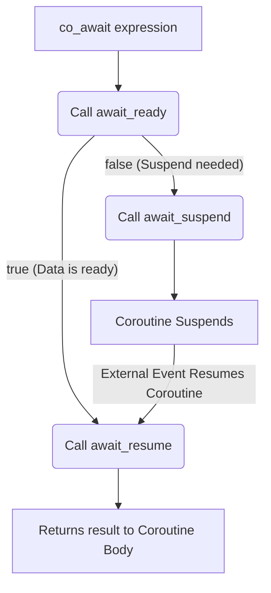

```mermaid
graph TD
    A[co_await expression] --> B(Call await_ready)
    B -- true (Data is ready) --> E(Call await_resume)
    B -- false (Suspend needed) --> C(Call await_suspend)
    C --> D[Coroutine Suspends]
    D -- External Event Resumes Coroutine --> E
    E --> F[Returns result to Coroutine Body]
```