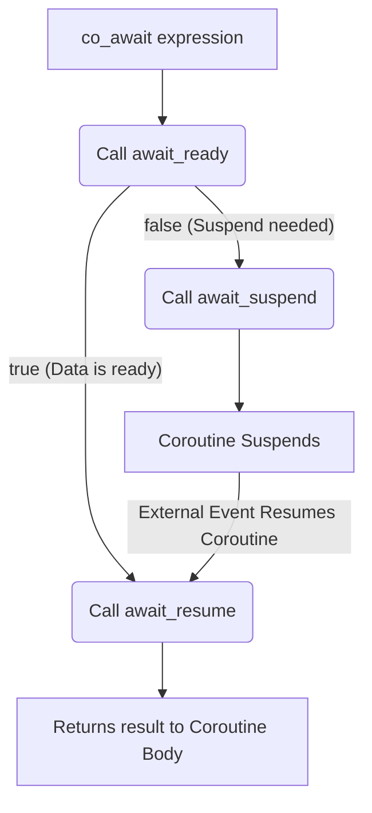

# Coroutines and asynchronous operations

dspsim processes can be C++20 coroutines (`Task<>` registered with `DSPSIM_CORO`) or Python `async def`
coroutines (`Module.add_task`). This document covers the awaitable framework built on top of them:
how a coroutine waits, how modules offer asynchronous operations such as `axis_rx.receive(n, timeout)`,
and how ordinary code (a `main()` or a pytest) drives them with `Context::run_until`.



## Building blocks

There are three kinds of things you can `co_await` / `await`:

| Kind | C++ | Python | What it does |
| --- | --- | --- | --- |
| Leaf wait | `wait(...)` on `Module`/`Context` | `self.wait(...)` / `ctx.wait(...)` | Suspends the **process** until the scheduler wakes it. |
| Task | `Task<T>` coroutine method | any awaitable, incl. bound C++ tasks | Runs a coroutine inline in the awaiting process and yields its value. |
| Entry point | `ctx->run_until(task, timeout)` | `ctx.run_until(task, timeout)` | Runs the simulation until a task completes, from non-coroutine code. |

### Leaf waits

A leaf wait schedules the wakeup in its constructor and suspends the coroutine. All leaf awaitables derive
from `WaitBase`, which records the suspended coroutine as the process's *resume point*, so that nested tasks
resume at the innermost suspension.

| Wait | Resumes when |
| --- | --- |
| `wait()` | any event of the static sensitivity list (`always(...)`) triggers |
| `wait(time_delta)` | `time_delta` time units have elapsed |
| `wait(event)` / `wait({e1, e2})` | the event (any of the events) triggers |
| `wait(event, timeout)` / `wait({e1, e2}, timeout)` | an event triggers **or** `timeout` elapses; returns `WaitResult::Triggered` or `WaitResult::Timeout` |

Semantics that matter when writing modules:

- A suspended coroutine resumes for exactly one reason. Dynamic waits (events, time, event+timeout) disable
  the process's static sensitivity until they complete, and the losing side of an event+timeout is dismissed:
  the process is unsubscribed from the events when the timeout fires, and a pending time wait is dropped if the
  process was resumed first (time events carry the process's `wake_count` at scheduling time).
- `next_trigger(time)` on a method process is different: it schedules an additional wakeup and never cancels.
- A timeout of `0` means no timeout. In C++, a literal `0` is ambiguous with the `ProcessBase*` argument, so
  use the overload without a timeout instead.
- Waits take the process to wake from `Context::_current_process`, so they are only valid inside a running
  process (a coroutine body or a task passed to `run_until`).

### Tasks: `Task<T>`

`Task<T>` is the coroutine return type. `Task<>` (void) is a process body; any `Task<T>` can be awaited by
another coroutine of the same process:

```cpp
Task<std::vector<T>> receive(size_t n, uint64_t timeout = 0)
{
    const uint64_t deadline = context()->time() + timeout;
    while (fifo.size() < n)
    {
        if (timeout == 0)
        {
            co_await wait(received_);
        }
        else if (context()->time() >= deadline ||
                 (co_await wait(received_, deadline - context()->time())) == WaitResult::Timeout)
        {
            break;
        }
    }
    co_return take(n);
}
```

- Awaiting a task starts it (symmetric transfer) and resumes the awaiter when it `co_return`s, with its value.
  An exception thrown by a nested task is rethrown in the awaiter; one thrown by a root task propagates out
  of `Context::run()`/`eval()`.
- A task runs in whichever process awaits it. That is what lets `axis_rx.receive()` be awaited from a module's
  coroutine, from a `run_until` task in `main()`, or from a Python coroutine.
- Keep a task alive until it is done. `co_await module.receive(...)` on a temporary is fine: the temporary lives
  for the whole `co_await` expression.

**This is the extension point.** To add an asynchronous operation to a module, write a coroutine method
returning `Task<T>` that loops on leaf waits. You should not need to write a new awaiter class; if you do
(a wait on something the scheduler doesn't know about yet), derive from `WaitBase`, schedule the wakeup
through `ProcessBase` in the constructor, and keep `await_suspend()` as inherited.

Modules usually pair the operation with a `SensitivityEvent` member that the module's own process notifies
(`received_.notify()` after pushing to the fifo), so the awaiting task wakes exactly when the state changed
instead of polling the clock. `AxisRx` (`receive`, `received()`) and `AxisTx` (`send`, `drain`, `sent()`)
are the reference implementations.

### Entry point: `Context::run_until`

`run()` advances a fixed amount of time. `run_until` advances event-to-event until a task completes and
returns its value, which is how a non-coroutine `main()` or test uses the awaitables:

```cpp
ctx->elaborate();
axis_rx.ready(1);
axis_tx.push_range(samples);
auto rx = ctx->run_until(axis_rx.receive(samples.size(), /*timeout=*/1000));
```

- The task is registered as a one-shot process, scheduled immediately, and removed afterwards (its dynamic
  subscriptions and pending time events are cleaned up), so `run_until` can be called repeatedly and mixed
  with `run()`.
- `run_until(task, timeout)` throws `dspsim::TimeoutError` if the task is not done after `timeout` time
  units, with the simulation left at the deadline. `timeout == 0` disables it; with a free-running clock and a
  task that never completes, that runs forever, so prefer a timeout.
- It throws `std::runtime_error` if the simulation stalls (no pending time events) before the task completes.
- `run_until(event, timeout)` is the simple case: `true` if the event triggered, `false` on timeout.
- Inside a coroutine there is no need for `run_until`: `co_await wait(event, timeout)` is the equivalent.

## Python

Python coroutines are driven by `PyTask` processes; Python's own `await` handles nesting. Everything above
is available with the same names:

```python
with Context() as ctx:
    with ctx.construct():
        clk = Clock("clk", 10)
        tx, rx = AxisTxS32("tx"), AxisRxS32("rx")
        ...

    async def main():
        rx.ready = 1
        assert await tx.send([1, 2, 3, 4], timeout=1000)
        return await rx.receive(4, timeout=1000)

    data = ctx.run_until(main(), timeout=10_000)        # -> [1, 2, 3, 4]
    data = ctx.run_until(rx.receive(4, timeout=1000))    # a C++ task directly
    ok = ctx.run_until(rx.received, timeout=100)         # an event
```

- `await self.wait(event, timeout=100)` returns `WaitResult.Triggered` or `WaitResult.Timeout`.
- `dspsim.framework.TimeoutError` subclasses the builtin `TimeoutError`.
- Bound C++ tasks (`Task`, `TaskBool`, `TaskListS32`, ...) are awaitable objects. They must be awaited from a
  task running in the simulation (`Module.add_task` or `Context.run_until`), never from `asyncio`.

### Exposing a C++ task to Python

Bindings wrap a `Task<T>` with `py_task(context, task)` and need a `bind_task<T>(m, "TaskName",
"python result type")` registration once per result type `T` (see `_framework.cpp`):

```cpp
.def("receive", [](AxisRx<T> &self, size_t n, uint64_t timeout)
     { return py_task(self.context(), self.receive(n, timeout)); },
     nb::arg("n"), nb::arg("timeout") = 0)
```

`PyTaskAwaitable<T>` implements `__await__` as a Python generator: it starts the C++ task (which suspends on
its first leaf wait and records the process's resume point), yields to the scheduler, and steps the C++ task
from the resume point each time the Python coroutine is resumed, until it is done.

## Caveats

- A task passed to `run_until` should only use dynamic waits. Static sensitivity (`always`) on it would keep
  dangling subscriptions after the process is removed.
- Don't destroy a `Task<T>` that is suspended inside the scheduler (e.g. by dropping it before it is done),
  and don't await the same task twice.
- `Wait*` objects schedule their wakeup on construction: construct one only to await it immediately.
